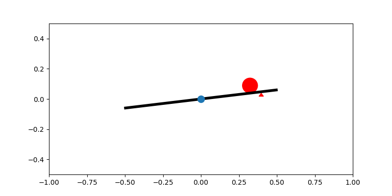

[](https://pypi.python.org/pypi/ballbeam-gym/) 
[](https://github.com/simon-larsson/ballbeam-gym/blob/master/LICENSE)

# Ball &amp; Beam Gym
Ball & beam simulation as OpenAI gym environments.

## Installation

Run command:

    pip install ballbeam-gym

or clone the repository and run the following inside the folder:

    pip install -e .


## System Dynamics
Simulated as a frictionless first order system that takes the beam angle as input. The equation that describe the system is as follows:

    dx/dt = v(t)
    dv/dt = -m*g*sin(theta(t))/((I + 1)*m)

[](https://github.com/simon-larsson/ballbeam-gym)

## Environments
- **BallBeamBalanceEnv** - Objective is to not drop the ball from the beam.
- **BallBeamSetpointEnv** - Objective is to keep the ball as close to a set position on the beam as possible.

### BallBeamBalanceEnv

Ball is given a random initial velocity and it is the agents job to stabilize the ball on the beam.

**Parameters**
- `timestep` - Length of a timestep.
- `beam_length` - Length of beam.
- `max_angle` - Max/min angle of beam.

**Observation Space:** 
- Beam angle
- Ball position on beam.
- Ball velocity

**Action Space:**
- Beam angle

**Rewards**

A reward of +1 is given for each timestep ball stays on beam.

**Reset**

Resets when ball falls of beam.

### BallBeamSetpointEnv

The agent's job is to keep the ball's position as close as possible to a setpoint.

**Parameters**
- `timestep` - Length of a timestep.
- `setpoint` - Ball setpoint position on beam (`None` for random).
- `beam_length` - Length of beam.
- `max_angle` - Max/min angle of beam.

**Observation Space:** 
- Beam angle
- Ball position
- Ball velocity
- Setpoint position

**Action Space:**
- Beam angle

**Rewards**

At each timestep the agent is rewarded with the squared proximity between the ball and the setpoint: 

`reward = (1 - (setpoint - ball_position)/beam_length)^2`.

**Reset**

Resets when ball falls of beam.

## API

The environments use the same API and inherits from OpenAI gyms.
- `step(action)` - Simulate one timestep.
- `reset()` - Reset environment to start conditions.
- `render()` - Visualize one timestep.
- `seed(seed)` - Make environment deterministic.

## Example with PID
```python
import gym

# pass env arguments as kwargs
kwargs = {'time_step': 0.05, 
          'setpoint': 0.4,
          'beam_length': 1.0,
          'max_angle': 0.2}

# create env
env = gym.make('BallBeamSetpoint-v0', **kwargs)

# constants for PID calculation
Kp = 2.0
Kd = 1.0

# simulate 1000 steps
for i in range(1000):   
    # control theta with a PID controller
    theta = Kp*(env.bb.x - env.setpoint) + Kd*(env.bb.v)
    obs, reward, done, info = env.step(theta)
    env.render()
```

## Example with reinforcement learning
```python
import gym
from stable_baselines.common.policies import MlpPolicy
from stable_baselines.common.vec_env import DummyVecEnv
from stable_baselines import PPO2

# pass env arguments as kwargs
kwargs = {'time_step': 0.05, 
          'setpoint': 0.4,
          'beam_length': 1.0,
          'max_angle': 0.2}

# create env
#env = gym.make('BallBeamBalance-v0', **kwargs)
env = gym.make('BallBeamSetpoint-v0', **kwargs)

# train a mlp policy agent
env = DummyVecEnv([lambda: env])
model = PPO2(MlpPolicy, env, verbose=1)
model.learn(total_timesteps=20000)

obs = env.reset()
env.render()

# test agent on 1000 steps
for i in range(1000):
    action, _ = model.predict(obs)
    obs, reward, done, info = env.step(action)
    env.render()
    if done:
        env.reset()
